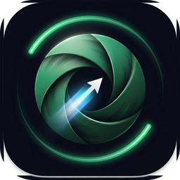

<p align="center">
  
</p>

# <p align="center">Capturia</p>

<p align="center"><strong>Free, open-source screen recorder and editor — intelligent cursor tracking, zoom effects, and cinematic output.</strong></p>

<p align="center">
  <a href="https://github.com/MinhOmega/Capturia/blob/main/LICENSE"></a>
  <a href="https://github.com/MinhOmega/Capturia/releases/latest"></a>
  
</p>

> [!IMPORTANT]
> **Capturia is a fork of [OpenScreen](https://github.com/getopenscreen/openscreen).**
> It is re-baselined on upstream **v1.10.0** (commit `70e30c1f`), and most of this
> codebase is still OpenScreen's work. OpenScreen is MIT licensed and its copyright
> notice is preserved in [LICENSE](./LICENSE) alongside ours, as that licence requires.
>
> Capturia is **not affiliated with, endorsed by, or supported by** the OpenScreen
> project. Please do not take Capturia's bugs to their issue tracker — report them
> [here](https://github.com/MinhOmega/Capturia/issues) instead.

## Features

- Record a whole screen or a single window, with microphone and system audio.
- Webcam overlay with picture-in-picture, drag-to-position, mirroring and shape options.
- Auto or manual zooms with adjustable depth, duration and easing; auto-zoom follows the cursor.
- Cursor themes, size and smoothing, with click effects and post-recording path smoothing.
- On-device captions for voiceovers — nothing is uploaded, and it works offline.
- Wallpapers, gradients, solid colours or your own image as a background.
- Crop, trim, per-segment speed, motion blur, and text/arrow/image annotations.
- Export to MP4 or GIF at several aspect ratios, rendered on the GPU with a CPU fallback.

## Install

Download the installer for your platform from the
[Releases page](https://github.com/MinhOmega/Capturia/releases).

**Requirements:** macOS 13 (Ventura) or later, Windows 10 1903+ (build 18362), or a Linux
desktop with `xdg-desktop-portal` and PipeWire. 8 GB RAM minimum, 16 GB recommended.

On macOS, grant **Screen Recording** and **Accessibility** under *System Settings > Privacy
& Security* on first launch — recording cannot start until both are granted.

## Development

```bash
npm ci
npm run dev
```

See [CONTRIBUTING.md](./CONTRIBUTING.md) for the full setup, including the native capture
helpers and the compositor addon, which are built per platform.

## License

[MIT](./LICENSE) — covering both Capturia's work and the OpenScreen code it derives from.
Third-party components bundled in the installers are listed in
[THIRD-PARTY-NOTICES.md](./THIRD-PARTY-NOTICES.md).
